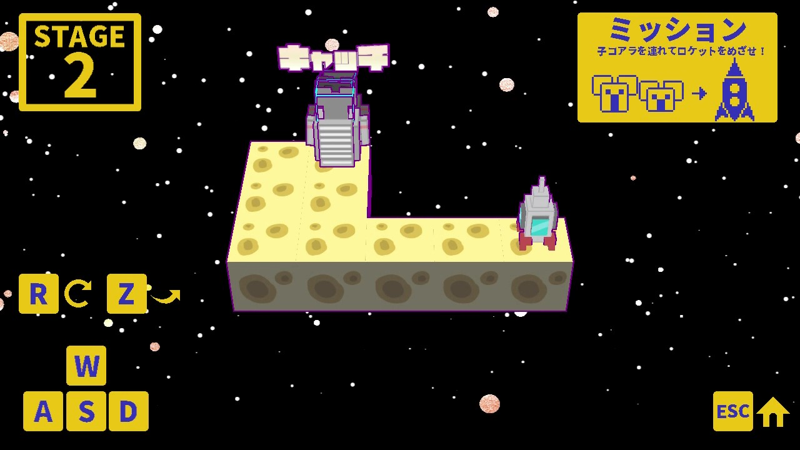
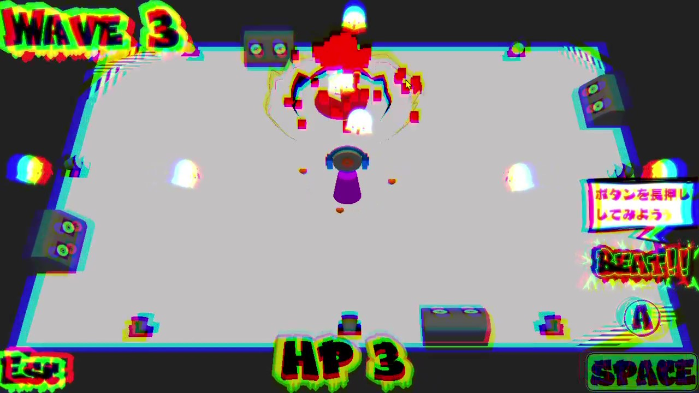
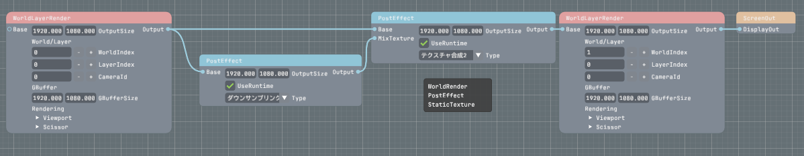
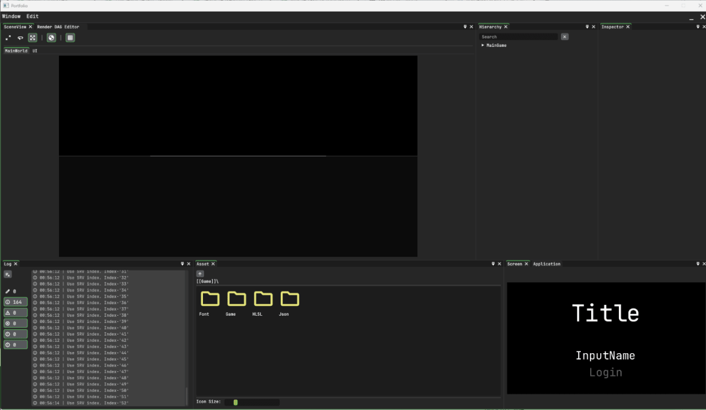

# SyzygyEngine

[](https://github.com/TaiseiHamaya/SyzygyEngine/actions/workflows/BuildCheck.yml)

SyzygyEngine is a Windows-focused C++20 game engine with a DirectX 12 renderer, scene-based runtime framework, and integrated debug/editor tooling.

The repository is designed to be used with the included project generator, which creates a full game solution that references this engine as a submodule.

## Showcase

### Developed games





### Engine features





## Features

- DirectX 12 rendering pipeline with Shader Model 6.6
- Scene-driven runtime flow (initialize, setup, update, draw, finalize)
- Render DAG-based rendering path configuration
- Built-in asset systems for:
	- Meshes
	- Textures
	- Shaders
	- Audio
	- Skeleton and node animation
	- Primitive
- Background asset loading
- Debug/editor mode (ImGui-based) with:
	- Hierarchy and scene view tools
	- Asset browser and asset import helpers
	- Render DAG editor
	- In-editor log window
- Configurable project settings via JSON (window, graphics, frame settings)

## Requirements

- Windows 11 / Visual Studio 2022 (MSVC v143)
- Windows SDK 10.0.26100.0 or compatible
- PowerShell, Git
- GPU with DirectX 12 support (Feature Level 12.0+, Shader Model 6.6, Bindless resources)

## External Libraries

The engine includes and/or references the following libraries inside the repository:

- [asio](https://think-async.com/Asio/)
- [assimp](https://github.com/assimp/assimp)
- [DirectXTex](https://github.com/microsoft/DirectXTex)
- [freetype](https://freetype.org/)
- [imgui](https://github.com/ocornut/imgui) (with [ImGuizmo](https://github.com/CedricGuillemet/ImGuizmo) and [ImNodeFlow](https://github.com/Fattorino/ImNodeFlow) extensions)
- [msdf-atlas-gen](https://github.com/Chlumsky/msdf-atlas-gen)
- [nlohmann/json](https://github.com/nlohmann/json)

## Quick Start (Recommended)

1. Open a PowerShell terminal in a directory where you want to create your game project.
2. Download and run the generator script:

```powershell
curl -o CreateSolution.ps1 https://raw.githubusercontent.com/TaiseiHamaya/SyzygyEngine/refs/heads/master/ProjectGeneratorTool/CreateSolution.ps1; .\CreateSolution.ps1
```

Or if you want to select engine branch:
```powershell
curl -o CreateSolution.ps1 https://raw.githubusercontent.com/TaiseiHamaya/SyzygyEngine/refs/heads/master/ProjectGeneratorTool/CreateSolution.ps1; .\CreateSolution.ps1 -b:<branch_name>
```

3. Open the generated solution:

```text
MyGame/project/MyGame.sln
```

4. Build with Visual Studio (x64, Debug / Develop / Release).

The generated solution includes:

- Game (your project, static library)
- SyzygyEngine (engine executable)
- DirectXTex
- imgui
- Asio

## Project Structure

```text
SyzygyEngine/
├─ Engine/
│  ├─ Application/        # Framework, window app, logging, project settings
│  ├─ Assets/             # Asset types and libraries (mesh, texture, shader, audio, animation)
│  ├─ Debug/              # Editor, profiler, ImGui integration
│  ├─ GraphicsAPI/        # Rendering API layer (DirectX)
│  ├─ Loader/             # Scene/world and asset loading helpers
│  ├─ Module/             # World, rendering, and management modules
│  └─ Runtime/            # Scene manager, input, clock
├─ EngineResources/       # Engine-side HLSL and built-in resources
├─ Library/
│  ├─ Externals/          # Third-party dependencies
│  ├─ Math/               # Math library
│  └─ Utility/            # Utility layer and templates
└─ ProjectGeneratorTool/
   ├─ CreateSolution.ps1
   └─ CopyFolderRoot/     # Template files for generated game projects
```
